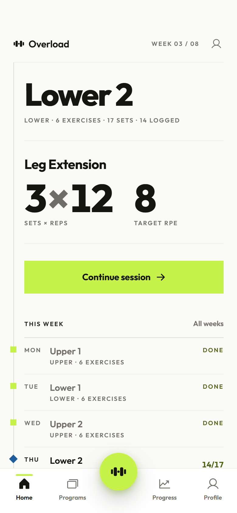
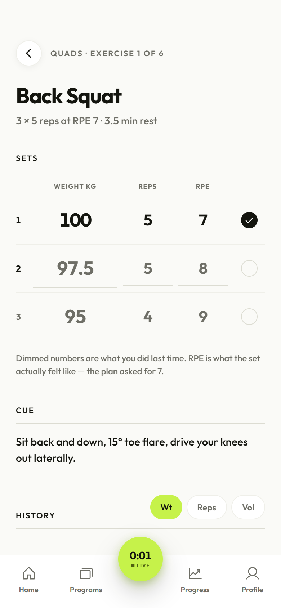
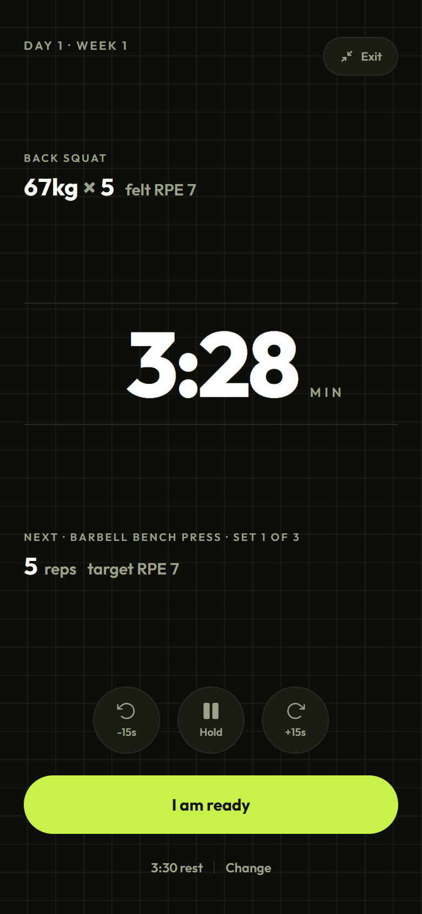
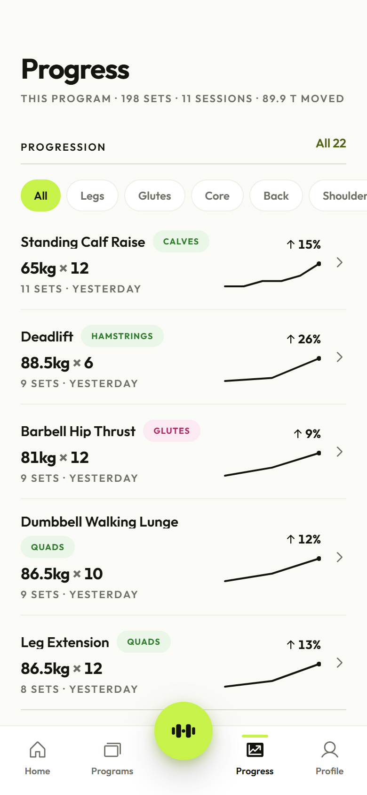

# Overload

A strength-training log built for the gym floor — one hand, bad signal, halfway
through a set.

**[overloadv1.vercel.app](https://overloadv1.vercel.app)**

<p align="center">
  
  
  
  
</p>

---

## What it is

Most training apps are an empty ledger you freestyle into. Overload is the other
thing: you run a **program**, and logging fills it in.

Two decisions shape everything else.

**Effort is data.** Every logged set records the RPE it actually felt like,
beside the RPE the plan asked for. Other loggers treat that as an optional extra
field; here the gap between the two is the point. It is the number you decide
next week's weight from, so the app puts it where the decision happens —
adjacent on the rest timer, dimmed into the field you are about to fill.

**The program is the spine.** A block runs 4–16 weeks. Every logged set belongs
to a planned one, which is what lets the app tell you that this is set 2 of 3 of
Back Squat in week 3, and what your last three attempts at it were.

Neither of those requires you to think about them. The screen you spend the most
time on records three numbers and shows what you did last time, and that is all
it does.

## How it works

Pick one of three bundled 8-week programs or build your own week by week. Each
session holds ordered exercises drawn from a 160-exercise library, each with sets,
reps, a target RPE, a rest length and a coaching cue. When the library does not
have what your gym does, add your own — it joins your search results and tracks
history exactly like a bundled one.

Mid-session you get one screen per exercise: three numbers to fill in, with last
session's values dimmed in place so the comparison needs no arithmetic. Checking
a set off starts the rest timer, which shows the set that just closed above the
set the plan asks for next, and closes the gap between them as the clock runs
down.

Between sessions, Progress answers one question — are the numbers moving — as one
row per lift: best set, direction, and the last eight sessions plotted.

## Running it

Needs Node 20+ and a Postgres database. [Neon](https://neon.tech) has a free tier
and is what the deployment uses.

```bash
git clone https://github.com/adilsay3d22/OverLoad.git
cd OverLoad
npm install
```

```bash
cp server/.env.example server/.env
```

Put a connection string in `DATABASE_URL`, generate a secret for
`OVERLOAD_JWT_SECRET` (`openssl rand -base64 48`), then:

```bash
npm run db:migrate   # create the tables
npm run db:check     # prove the connection and the schema
npm run dev          # api on :4000, client on :5173
```

Sign up and you get genuinely empty screens — no program, nothing to chart. To
work on the analytics screens you need history, so there is a developer fixture:

```bash
npm run db:seed      # one account, a full program, three weeks of logged sets
```

It refuses to run unless `OVERLOAD_ALLOW_SEED=1` is set, which belongs in a
development branch's `.env` and in no deployment. Fabricated training history
must never reach a database real people use.

| Script | |
|---|---|
| `npm run dev` | API and client together, watching |
| `npm run build` | production build of the client |
| `npm run db:migrate` | apply `server/db/schema.sql` (idempotent) |
| `npm run db:check` | connection + every expected table |
| `npm run db:inspect` | what is actually in the database `.env` points at |
| `npm run db:seed` | the developer fixture |
| `npm run db:reset` | empty it, keeping the schema (needs `--yes`) |
| `npm run db:import` | migrate a legacy `server/data/store.json` in |

## Built with

React 19 and Vite, Tailwind v4, Motion, React Router. Express behind a relational
Postgres schema, with JWT auth and bcrypt. Deployed on Vercel — the built client
from the CDN, the same Express app as one serverless function, talking to Neon
over HTTP. See [DEPLOY.md](DEPLOY.md).

```
api/index.js          Vercel entry point — hands every request to the Express app
client/               React app; screens/, components/, state/, lib/
server/src/routes/    auth, catalog, programs, logs, progress
server/src/lib/       repo.js (data access), progress.js (aggregates), sql.js
server/db/schema.sql  the whole schema
docs/design-handoff.md  the original design specification
```

## The schema, and two constraints that shaped it

**Deleting a plan never deletes history.** Logs carry no foreign key to programs,
weeks, sessions or entries, and keep their own copy of the program name, session
name and exercise name. Delete a program and every set you logged against it
stays readable, still counted in your all-time progress and personal records.
Users restructure and abandon programs constantly; logged work is never
collateral damage.

**Weights are stored in kilograms.** Pounds is a display preference, converted at
the edges. `numeric` throughout rather than float, because 2.5 kg plate steps and
0.5 RPE steps must not drift.

A saved template is a program with `kind = 'template'` — the same shape, so it
reuses the same tables rather than growing a parallel set of them.

## Not built yet

Honest about what is missing, because none of it is hard to overlook until
someone needs it:

- **No password reset.** Forgetting your password means a manual fix in the
  database. This is the first thing to add before sharing the link widely.
- **No email verification**, and no rate limiting on login. Passwords are bcrypt
  hashed, but nothing slows down guessing.
- **Deleting your data** works; deleting your *account* does not.
- **No internationalisation.** English and metric-first only.
- **Set writes queue offline** and replay on reconnect, but nothing else does.

## Licence

[MIT](LICENSE). Use it, fork it, ship it.

The bundled `exercises.json` and `templates.json` are data that came with the
project rather than code, and the training programmes in them are built from
publicly published material — see Credits.

## Credits

The three bundled programs are built from publicly published Jeff Nippard
training templates. This project is not affiliated with or endorsed by him.

The interface follows a design specification written before any of it was built,
preserved at [docs/design-handoff.md](docs/design-handoff.md); the visual system
it became is documented in [client/DESIGN.md](client/DESIGN.md), and the product
decisions behind it in [client/PRODUCT.md](client/PRODUCT.md).
